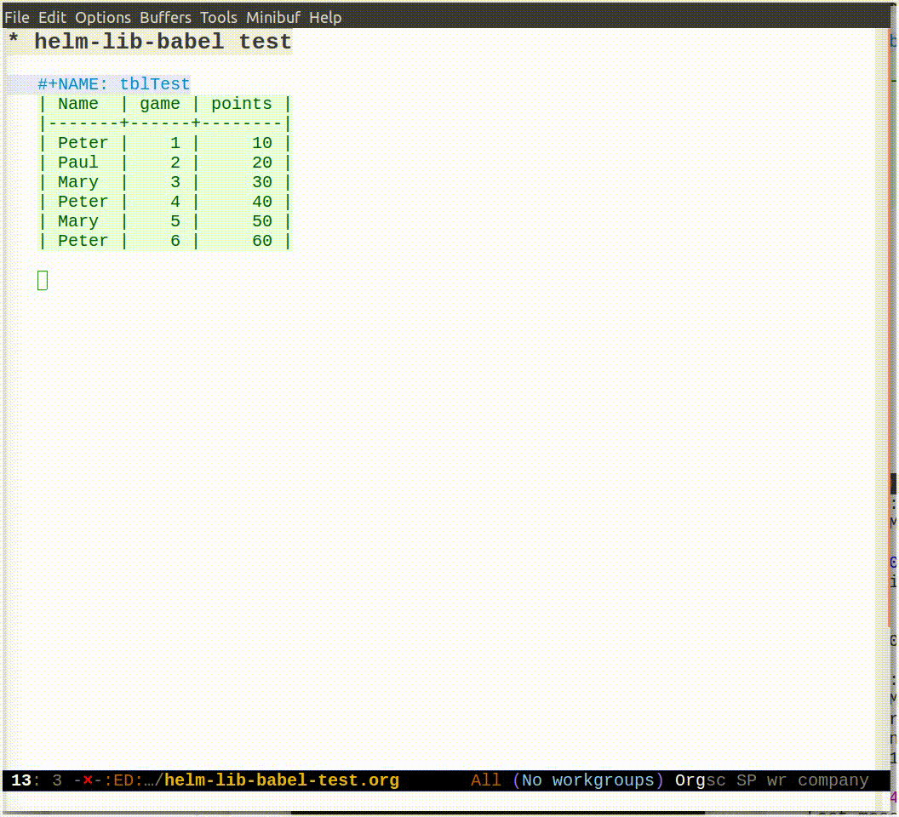

# Table of Contents

1.  [helm-lib-babel](#orgf025076)
2.  [Installation](#org4d30e13)
3.  [Motivation](#orgab6ec4d)

# helm-lib-babel

`helm-lib-babel` provides a convenient helm lookup function for
org-mode's ability to use previously defined named source code
blocks like functions (typically inserted via a `#+CALL:`
statement). The available functions consist of all named functions
found in the current file and the user's library of babel.

# Installation

Install the raw package and then just use

    (require 'helm-lib-babel)

or better, use `use-package`

    (use-package helm-lib-babel)

There are no configuration settings needed by the package. If you do not
have an own library of babel (defined via `org-babel-lob-ingest`), then
only the named source blocks of the file you are currently visiting
will be offered.

# Motivation

Despite having used Org mode's source code blocks for many years,
I never had really made friends with the [Library of Babel](https://orgmode.org/worg/org-contrib/babel/library-of-babel.html) feature,
which allows using source blocks defined in other org files in
the current file.

Among the reasons was that it is awkward to look up the remote
source block's definition, its name and arguments. This is
resolved by this little helm extension.

I am making use of many table related functions in my work, and
Over the last few years I am spending an ever increasing part
of my work life in Emacs and Org mode. I found that there are
a lot of source block functions which I want to re-use between files.
While I am not a huge fan of the library of babel mechanism, for
this number of very often used functions, it is convenient.

One must be concious that the files that are created with library of
babel references are no longer self-contained, because they
reference code outside of the current org file. So, handing them to
others is not easily possible, except if one adds the library files
as well.

In the end the *library of babel* is only a very weak replacement
for a real dynamic "library loader" feature which would allow to
reference the used libraries within the org file. But then maybe we
would start to overload org-mode and make it to a full
meta-programming environment that requires library default paths,
etc. Naturally it would be possible to put the execution of an
`org-babel-lob-ingest` form into the file variables of the org-file,
but that is rather hacky.

